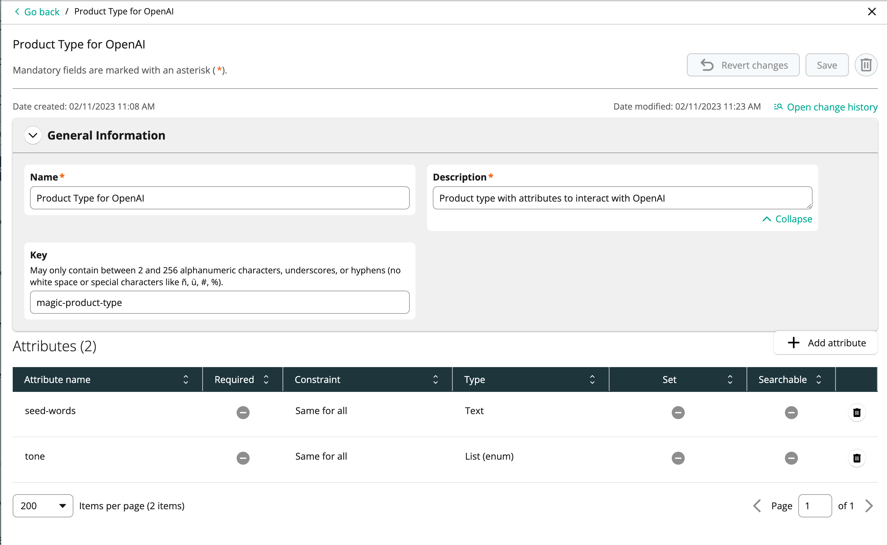

# commercetools Magic
Utilize OpenAI's APIs to dynamically create Product Descriptions in commercetools Composable Commerce.

https://user-images.githubusercontent.com/79161219/218758219-12ed0eb9-0ca3-4ee9-a846-2fcad39ce93e.mov

This repository contains all the necessary components to create and deploy a functioning example of integrating commercetools Composable Commerce with OpenAI. Including:
- commercetools configuration
  - Product Type (includes attributes to prompt OpenAI with keywords and tone for product description context)
  - Product States and Transitions (identify and automate products which are ready for a generated desription)
  - Subscription (automates the call to the processing )
- Google Cloud components
  - Pub/Sub Topic and Subscription
  - Cloud Function

## Requirements
- [commercetools Composable Commerce Project](https://docs.commercetools.com/getting-started/)
  - [API Client](https://docs.commercetools.com/getting-started/create-api-client) with manage_products scope (for app)
  - API Client with manage_project scope (for Terraform)
- [OpenAI API Key](https://help.openai.com/en/articles/4936850-where-do-i-find-my-secret-api-key)
- [nodejs 18](https://nodejs.org/en/download/)
- [gcloud tools](https://cloud.google.com/sdk/docs/install)
- [Terraform](https://developer.hashicorp.com/terraform/tutorials/aws-get-started/install-cli)
- [Google Cloud Account & Project](https://console.cloud.google.com/)

## commercetools Setup
Running the Terraform setup will create the following in commercetools Composable Commerce:
  

## Configuration
### Environment Variables

###

## Deployment

### Apply Terraform 

### Deploy Google Cloud Function
```
gcloud functions deploy magic-description \
  --gen2 \
  --region=us-central1 \
  --runtime=nodejs18 \
  --entry-point=cloudEvent \
  --trigger-topic=product-state-transition
  --env-vars-file .env.yaml
```